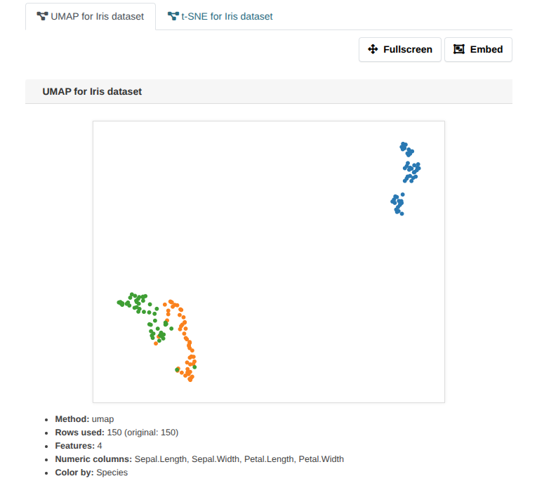
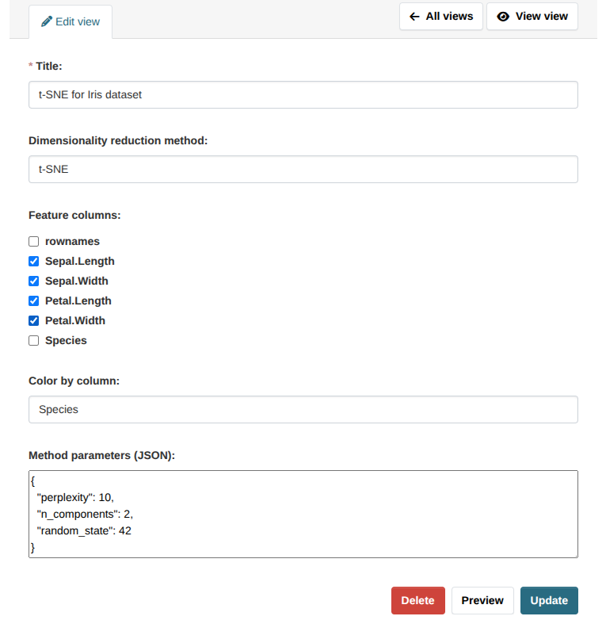
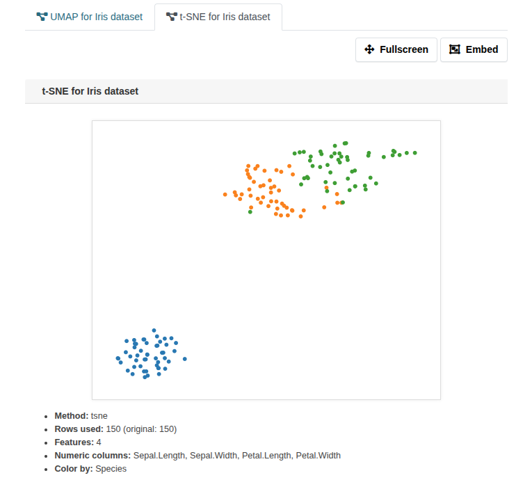

[](https://github.com/DataShades/ckanext-dimred/actions/workflows/test.yml)

# ckanext-dimred

Dimensionality-reduction preview for tabular resources. The extension adds a resource
view that:

Create the view, select a method, and generate a 2D projection of your data. You can
color points by a chosen column and control which columns are used as features.



## How it works

- Data loading: adapters handle CSV/TSV/XLS/XLSX; row sampling via
  `ckanext.dimred.max_rows`.
- Feature prep: numeric columns included; low-cardinality categoricals one-hot encoded
  if enabled; user can pick feature columns.
- Dimensionality reduction: choose [UMAP](https://umap-learn.readthedocs.io/)
  or [t-SNE](https://scikit-learn.org/stable/modules/generated/sklearn.manifold.TSNE.html),
  with configurable defaults and per-view JSON overrides.
- Rendering: embedding plotted to PNG.
- API: `dimred_get_dimred_preview` returns embedding + meta (prep info, method params)
  for programmatic use.

## Usage

1. Add a tabular resource (csv/tsv/xls/xlsx).
2. Create a new resource view of type `dimred_view`.
3. (Optional) Choose method (`umap`/`tsne`), pick `Color by column`, and select feature
   columns.
4. Save or Preview to see the rendered embedding (PNG).

API: use `dimred_get_dimred_preview` with `id` (resource id) and `view_id` to retrieve
embedding/meta.

## Example

Iris dataset:

| rownames | Sepal.Length | Sepal.Width | Petal.Length | Petal.Width | Species    |
|----------|--------------|-------------|--------------|-------------|------------|
| 1        | 5.1          | 3.5         | 1.4          | 0.2         | setosa     |
| 2        | 4.9          | 3.0         | 1.4          | 0.2         | setosa     |
| ...      | ...          | ...         | ...          | ...         | ...        |
| 51       | 7.0          | 3.2         | 4.7          | 1.4         | versicolor |
| 52       | 6.4          | 3.2         | 4.5          | 1.5         | versicolor |
| ...      | ...          | ...         | ...          | ...         | ...        |
| 101      | 6.3          | 3.3         | 6.0          | 2.5         | virginica  |
| 102      | 5.8          | 2.7         | 5.1          | 1.9         | virginica  |
| ...      | ...          | ...         | ...          | ...         | ...        |


Creating the dimred view: Method, Feature selection, Color by:



Rendered 2D embedding PNG:



## Requirements

Compatibility with core CKAN versions:

| CKAN version    | Compatible?   |
| --------------- | ------------- |
| 2.9 and earlier | no            |
| 2.10+           | yes           |

## Installation

To install ckanext-dimred:

1. Activate your CKAN virtual environment, for example:

   . /usr/lib/ckan/default/bin/activate

2. Clone the source and install it on the virtualenv

   git clone https://github.com/DataShades/ckanext-dimred.git
   cd ckanext-dimred
   pip install -e .

3. Add `dimred` to the `ckan.plugins` setting in your CKAN
   config file (by default the config file is located at
   `/etc/ckan/default/ckan.ini`).

4. Restart CKAN. For example if you've deployed CKAN with Apache on Ubuntu:

   sudo service apache2 reload

## Config settings

General defaults:

- `ckanext.dimred.default_method` (default: `umap`)
- `ckanext.dimred.allowed_methods` (default: `umap tsne`)
- `ckanext.dimred.max_file_size_mb` (default: `50`)
- `ckanext.dimred.max_rows` (default: `50000`)
- `ckanext.dimred.enable_categorical` (default: `true`)
- `ckanext.dimred.max_categories_for_ohe` (default: `30`)

UMAP defaults:

- `ckanext.dimred.umap.n_neighbors` (default: `15`)
- `ckanext.dimred.umap.min_dist` (default: `0.1`)
- `ckanext.dimred.umap.n_components` (default: `2`)

t-SNE defaults:

- `ckanext.dimred.tsne.perplexity` (default: `30`)
- `ckanext.dimred.tsne.n_components` (default: `2`)

Example:

```
ckan.plugins = ... dimred

ckanext.dimred.allowed_methods = umap
ckanext.dimred.max_rows = 10000
ckanext.dimred.enable_categorical = true
```

## Developer installation

To install ckanext-dimred for development, activate your CKAN virtualenv and
do:

    git clone https://github.com/DataShades/ckanext-dimred.git
    cd ckanext-dimred
    pip install -e .
    pip install -r dev-requirements.txt

## Tests

To run the tests, do:

    pytest --ckan-ini=test.ini

## License

[AGPL](https://www.gnu.org/licenses/agpl-3.0.en.html)
