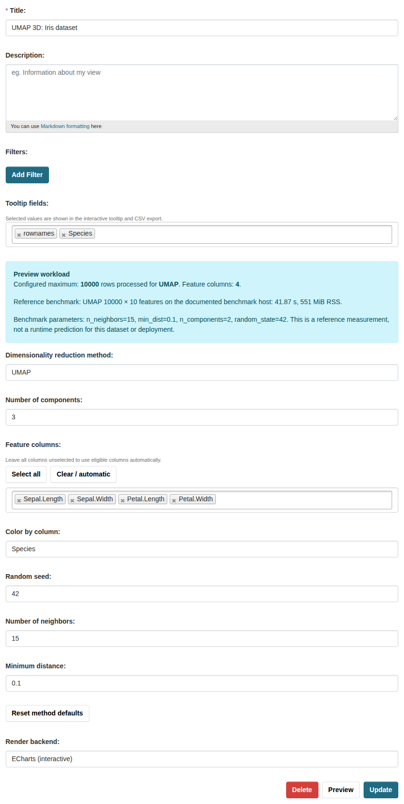
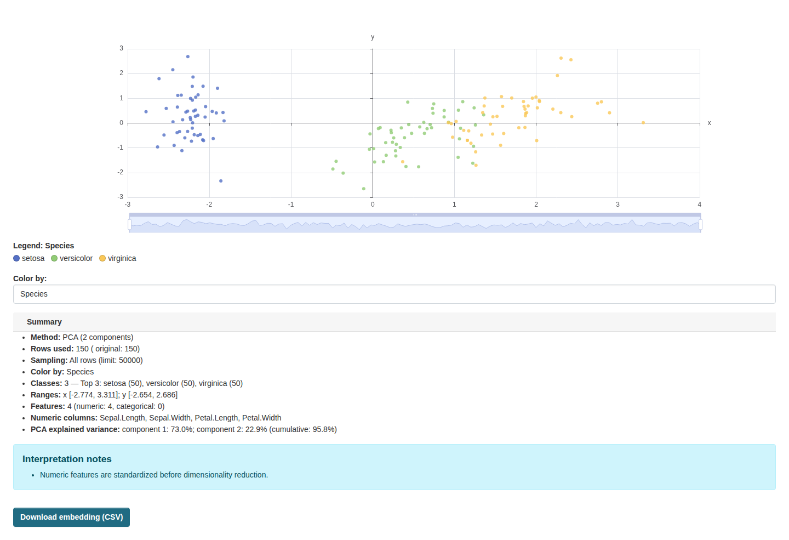
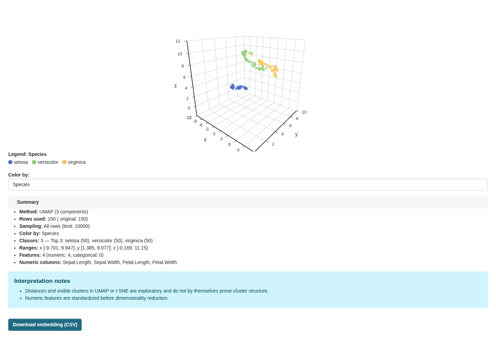

# Usage

## Create a view

1. Add a tabular resource in CSV, TSV, XLS, or XLSX format, or use an active
   DataStore resource.
2. Create a resource view of type `dimred_view`.
3. Choose a method: UMAP, t-SNE, or PCA.
4. Optionally select feature columns, a colour column, tooltip fields, method
   parameters, number of components, and a render backend.
5. Save or preview the view.

The configured render backend is the form default. ECharts provides an
interactive 2D/3D plot; Matplotlib provides a static PNG. Set `n_components` to
`3` for a 3D embedding. ECharts with `echarts-gl` supports rotate, zoom, and pan
for 3D plots.

## Features, colour, and context

Feature columns determine the matrix passed to the selected projection method.
Numeric columns are eligible automatically. Low-cardinality categorical columns
can be one-hot encoded when categorical features are enabled.

`Color by column` is metadata by default and is excluded from the embedding
features. To use it as a feature too, select it explicitly in **Feature
columns** after selecting it for colour. **Select all** intentionally excludes
the current colour column, while **Clear / automatic** removes the explicit
selection and returns to automatic eligibility.

`Tooltip fields` are contextual only: they do not affect the embedding or point
colour. Their sampled values appear in the interactive ECharts tooltip and in
the CSV export. A field already used for colour appears once as the colour
column. Matplotlib is static, so its contextual values are available through
the CSV export rather than the image.

Every explicitly selected feature or colour column must still exist on the
resource. A removed or renamed column produces a field-specific validation
error. Columns that are empty, mixed numeric/text, or datetime-like are skipped
by automatic selection; selecting one explicitly produces a `feature_columns`
validation error.

## Read a preview

Categorical colours use a bounded legend. Numeric colours use a continuous
scale with the column name. The preview summary states whether all rows were
used, a deterministic reservoir sample was taken, or a DataStore read was
bounded by the effective row limit. It also reports preprocessing and automatic
column skips.

PCA previews include explained variance for each displayed component and the
cumulative value. Missing and infinite numeric values are imputed before
dimensionality reduction. Boolean columns follow the categorical-feature
setting.

## Preview states and API

The view starts an asynchronous preview through `dimred_start_preview`. The
response is either `ready` with a result, `pending` or `running` with a `job_id`,
or `failed` with an error. Clients can poll `dimred_get_preview_status` with the
resource, view, and job IDs. CKAN authorization is checked when these actions
resolve the resource and resource view.

Use **Download embedding (CSV)** when export is enabled. The file contains the
coordinates and `source_row_id`, then the selected colour and contextual fields.
Values that spreadsheet applications could treat as formulas are neutralized in
the export.
